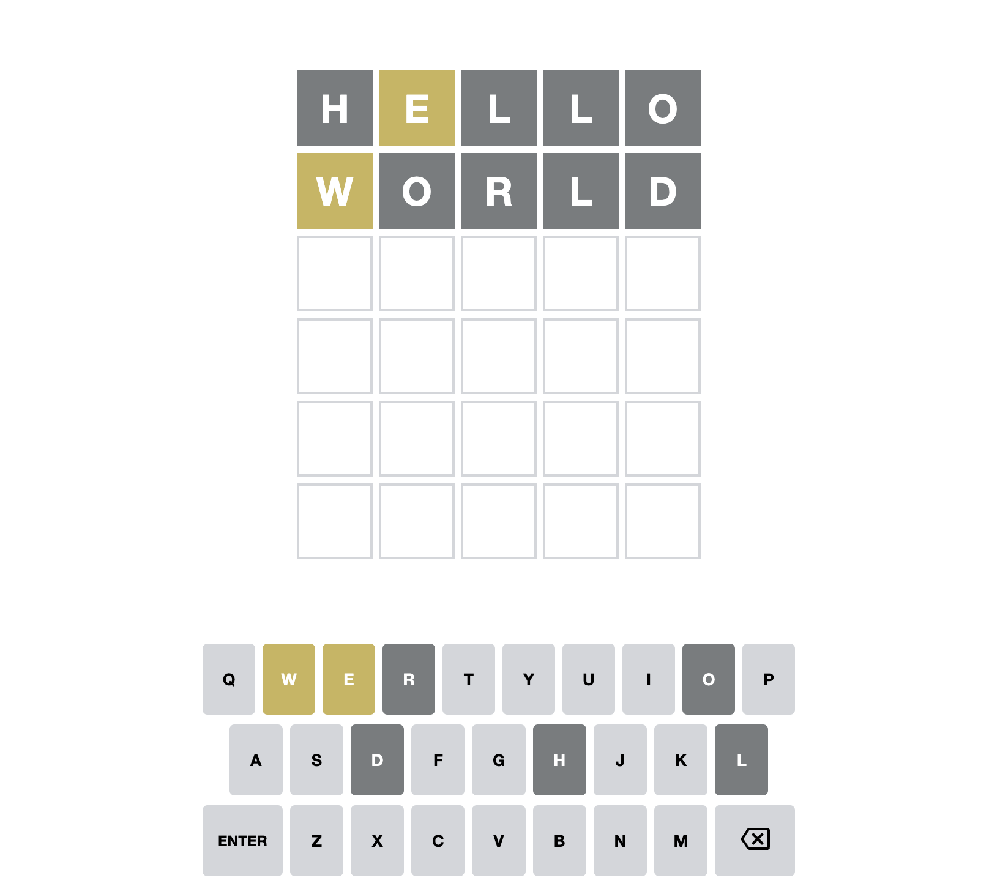

# Word Game DEMO

## ABOUT

A recreation a popular online word game, Wordle:

In Wordle, users have 6 attempts to guess a 5-letter word. You're helped along the way by ruling out letters that aren't in the word, and being told whether the correct letters are in the correct location or not.

## Getting Started

This project is created with [Parcel](https://parceljs.org/), a modern JS build tool. It's intended to be run locally, on your computer, using Node.js and NPM.

# STILL to be implemented

## Visual Keyboard

A keyboard to be shown below the guesses:

This keyboard is an important game element, since it makes it easy to tell which letters have already been tested.

**Note: Styling to be added.** at `src/styles.css`.

**TODO:**

- Render 3 rows of letters at the bottom of the screen
- The colors of each letter should match the colors shown in the game board:
  - Correct letters should have a green background and white text
  - Misplaced letters should have a yellow background and white text
  - Incorrect letters should have a dark gray background and white text
  - Unused letters should have a light gray background and black text
- No need to include "Enter" and "Backspace" keys.

## Restart button

One of Wordle's hooks is that you can only play 1 game per day: there's a new word for all users every day. As a result, there's no "restart button", you just have to wait until the next day.

Will update the game so that it can be restarted. Will be adding a "Restart game" button to the banner shown when the user wins or loses.

**TODO:**

- A "Restart Game" button is shown at the end of the game.
- Clicking the button should select a new correct word and reset all other state.
